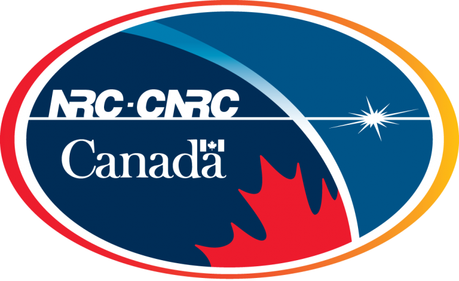

# Welcome to the Visual and Analytic Computing (VAC) Laboratory at Memorial University

We are located in the [Department of Computer Science](http://www.cs.mun.ca) at [Memorial University](http://www.mun.ca), working in areas at the intersection of visualization, imaging, artificial intelligence
and data analytics.

<!-- %
  include link.html
  type="github"
  icon=""
  text="See the template on GitHub"
  link="greenelab/lab-website-template"
  style="button"
%}
 -->
{:.center}





# Highlights



Our research focuses on visual and analytic computing, including: data visualization, scientific computing, computer graphics, computational imaging and artificial intelligence. 
We have a strong focus on development of holographic and light field displays and medical image analysis. 


{:.center}







{:.center}




<!-- 
Duis aute irure dolor in reprehenderit in voluptate velit esse cillum dolore eu fugiat nulla pariatur.
Excepteur sint occaecat cupidatat non proident, sunt in culpa qui officia deserunt mollit anim id est laborum.


{:.center}



-->

<!--

Lorem ipsum dolor sit amet, consectetur adipiscing elit, sed do eiusmod tempor incididunt ut labore et dolore magna aliqua.


{:.center}



-->

# Lab Partners

{:.center} 

  
<a href="https://spaces.facsci.ualberta.ca/ahci/news/media/"> AHCI Lab (University of Alberta, Computing Science) </a>  
<a href="http://www.cs.mun.ca/~asoaresjunio/">  Mobility and Data Analytics Lab (Memorial University, Computer Science)</a>

